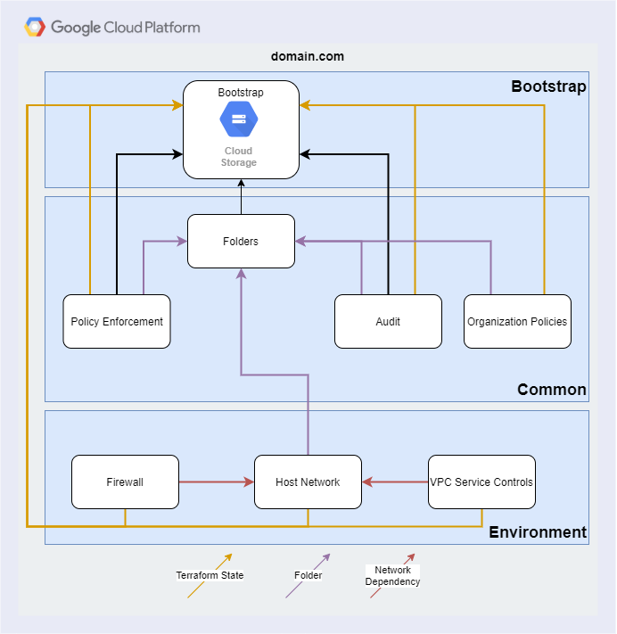

# GCP Landing Zone

## Overview
The GCP Landing Zone is a set of Terraform modules with baked in opinions that
can be used as the standard setup for a new GCP organization. Any
department that creates a new GCP organization can utilize this repository
and its processes to accelerate developement. This repository provides all the basic
pieces required to take a GCP organization from conception to application infrastructure
onboarding ready.

The goal is to provide:
1. GCP Bootstrap Project
    - Service Account (SA) with appropriate permissions that is used
      to deploy resources
    - Storage buckets which are used to store Terraform state (yaml) files
1. GCP Folder Structure
    - Basic GCP folder structure to hold projects deployed as part of other infrastructure
1. Organization Policy Constraints
    - Organization policies which provide security controls across the organization
1. Gurardrails
    - A set of resources to monitor compliance with the 30-Day Guardrails
      controls that can be monitored via code
1. Policy Enforcement
    - TODO
1. Log Bunkering
    - Log for audit and forensic purposes with Organization Log Sink
    - Locked storage bucket where logs cannot be altered or deleted and are retained
      for a configurable amount of time
1. Organization Level Custom Roles
    - Custom Roles created at the Oranization level that to be applied at the project level
1. DNS
    - Zone management for Organization Domain 
    - Forwarders to project sub-zones
1. Network
    - Leverages the unique GCP host network model
    - A Network host project to be used by other application projects
    - Initial Production and Non-Production host network with support for additional networks
1. Perimeter Network and Foritgate Firewall
    - A Perimeter network for access to the internet with Fortigate VMs to manage traffic
1. Firewall
    - Rules for ingress/egress to each of the above networks
    - Definition of the zone model
    - Allows for customizable rules
4. VPC Service Controls
    - Service Controls to configure allowed and disallowed access
5. Identity Aware Proxy
    - Central IAM and secure tunnel to access resources within GCP
6. Applications
   - GCP Project
   - Service Accounts
   - Policies
   - Apply IAM
   - Project level DNS zone

*Supporting Modules*
1. Naming
   - A module used to standardize resource names


Application projects are deployed using this landing Zone. Resources for
applications must be deployed using another process.

## Tools
The landing zone deployment process utilizes Terraform and Terragrunt.
Terraform is used to define and deploy the resources into GCP and Terragrunt is
used for variable injection so that terraform modules can be reused for deployment 
of the same kinds of resources.

Using Terraform alone would work, but brings unnecessary operational overhead, such as:
- Repeated code
    - The module of modules approach forces the definition of the same outputs and variables 
      on multiple levels
- Unnecessary API Calls
    - The module of modules approach causes every resources to be checked on the
      cloud provider every time the module is run
    - The manual process approach requires the operator to know the correct order to 
      to deploy the modules
    - Terraform remote states can be used to accomplish a similar result but is
      harder to track

Terragrunt streamlines the deployment of Terraform modules. It allows modules to inherit 
configuration from other areas of the repository. This enables the fundamental 
Don't Repeat Yourself (DRY) coding practice.

Terragrunt replaces the top level module of modules with one or many
`terragrunt.hcl` files. This file defines the location of the module to run, the
definition any dependencies that are used as inputs, and the inputs required.
This file can also define the configuration for the Terraform providers and
backend state files. A typical `terragrunt.hcl` file may look like this.

```hcl
    include {
        path = find_in_parent_folders()
    }

    locals {
        firewall = yamldecode(file("${get_terragrunt_dir()}/../../../config/nonp-non-sced-firewall.yaml"))
    }

    dependency "network" {
        config_path = "${get_terragrunt_dir()}/../non-sced-net-host-prj"
    }

    terraform {
        source = "git@github.com:GovAlta/terraform-gcp-firewall.git"
    }

    inputs = {
        project_id   = dependency.network.outputs.project_id
        network      = dependency.network.outputs.network_name
        custom_rules = local.firewall.nonpNonScedFirewall.customRules
    }
```

To set up your development environment please see [Developer.md](./Developer.md)

## Dependency Graph
Terragrunt replaces the module of modules pattern to allow each individual
module to have it's own state file, reducing the number of API calls.
Dependencies are defined in the `terragrunt.hcl` file and used as inputs to the
module. Terragrunt allows using the outputs of a module without redefining it
inside the terragrunt module, as seen in the example above.

This graph shows the dependency structure of the modules. The blue boxes indicate
the groups of modules that are deployed together as a Terragrunt apply while
maintaining separate Terraform state files.


## Configuration
As shown in the example above the configuration has been abstracted from the
Terragrunt module and places into a YAML file that can live outside of the
repository. This allows for a more complete reuse of the Terraform code, and a
lower barrier to entry for anyone not familiar with Terragrunt or Terraform.
The configuration data will need to be placed in `config` in the root of the
main repository at runtime. The file names must remain the same unless they
are changed in the appropriate `terragrunt.hcl` files.

For further details and the bootstrapping process see the
[Bootstrap.md](./Bootstrap.md)

## Updating Git Repositories and Sub-modules
This repository consists of the main directory where Github Actions workflow
resources are located and two Git sub-modules. The sub-modules are located in
the `core-infrastructure` and `documentation` directories. Each
sub-module can be stored in a separate location that suits the security profile.
The sub-modules are updated using the included bash shell script by running
`bash modupdate.sh`. The modules are downloaded in a `detached HEAD` state and
any changes to the files within will cause the sub-module to become inconsistent
and future updates using `bash modupdate.sh` will fail. Changes can be reverted
by moving into the directory and running `git reset --hard`. All changes to
sub-modules must be done in the repository where their source code is located.

Below is a current snapshot of the directory tree:
```bash
├── Makefile
├── README.md
├── config
│   ├── README.md
│   ├── bootstrap.hcl
│   ├── nonp-non-sced-firewall.yaml
│   ├── nonp-non-sced-network.yaml
│   └── organization-config.yaml
├── core-infrastructure
│   ├── bootstrap
│   │   ├── empty.hcl
│   │   └── terragrunt.hcl
│   ├── common
│   │   ├── core-audit-bunker
│   │   │   └── terragrunt.hcl
│   │   ├── core-folders
│   │   │   └── terragrunt.hcl
│   │   ├── core-org-policy
│   │   │   └── terragrunt.hcl
│   │   └── terragrunt.hcl
│   ├── nonp
│   │   ├── non-sced-net-firewall
│   │   │   └── terragrunt.hcl
│   │   ├── non-sced-net-host-prj
│   │   │   └── terragrunt.hcl
│   │   └── terragrunt.hcl
│   ├── prod
│   │   ├── net-host-prj
│   │   │   └── terragrunt.hcl
│   │   └── terragrunt.hcl
│   └── scripts
│       ├── bootstrap.sh
│       └── desktop_setup.sh
├── documentation
│   └── README.md
└── modupdate.sh
```

For detailed instruction see
[RepositoryUpdateProcedrures.md](./RepositoryUpdateProcedrures.md)

## Cloning the Landing Zone for your Organization
This repo, and the Git sub-modules for core-foundations and documentation can be
forked to a repository owned by your organization and can be used completely
unaltered. No configuration for the organization exists in the modules
themselves. The values are imported from the `config` folder, which can be
populated at run-time with the required files.

## Automated Deployments and Unit Testing
This repository include a Github Actions workflow file. The
`.github/workflows/*.yaml` files include the required steps to run unit tests,
release a version, or deploy the Landing Zone.

Github secrets are used to store potentially sensitive variables and securely
submit them to the jobs. These secrets are redacted in the logs and can not be
read by anyone. They can only be updated by a repository user with permissions.
The variables are:
- GOOGLE_APPLICATION_DEFAULT - GCP Service Account JSON Key file from the SA
  created in the bootstrap project.
- SSH_KEY - SSH Private Key for accessing required Terraform modules Git source
  repositories. This should be a service account and not linked to any
  particular end user.
- Other variables are necessary for running unit tests and should also be
  created in secrets on the respostory. See `.github\workflows\terragrunt.yaml`

Other potentially sensitive variables are stored in the
`config\organization-config.yaml` file which is to be kept private at the owners
discretion.

# Deployed Modules
## Bootstrap Process
After the Organization and Billing account have been created, the initial
resources must be created by a person with IAM privileges.

A script has been created that automates most of the configuration steps. The
high level steps are:
1. Create the required configuration files in the `config` directory
1. Run the [core-infrastructure/scripts/bootstrap.sh](../scripts/bootstrap.sh)
    - Creates the initial bootstrap project
    - Creates the Service Account (SA) that will be used going forward to deploy
      resources via Github Actions pipeline
    - Assigns required permissions to the SA
    - Creates Environment buckets to store Terraform state files
    - Create a `bootstrap.hcl` file in the [config](./../config) directory that
      defines options for Terragrunt going forward.
    - Uploads configuration files and bootstrap.hcl file to configuration bucket
1. Collect and store the SA JSON key file securely where it can be access by the
   pipeline to deploy resources on GCP.

For detailed instructions see [Bootstrap.md](./Bootstrap.md)

## GCP Folder Structure
To reduce operational complexity, GoA will implement the following structure:

1.	Six top-level folders: Infrastructure, Sandbo¬¬x, Workloads, Automation, Shared Services, Audit & Security
2.	Multiple projects, always provisioned together in the production and non-production (dev, uat, etc) folders under the top-level Workloads folder
Note: The Audit folder and project is to persist log data outside of the nonproduction and production GCP projects¬¬


The list of folder names to create in `organization-config.yaml`
```yaml
folders:
  parent: folders/102248106386
  names: 
    - Infrastructure
    - Sandbox
  subfolders_1:
    SharedInfrastructure: Infrastructure
    Networking: Infrastructure
    Prod: Workloads
```


## **Audit Log Bunker**
A log bunker project is created to hold a GCS bucket. This bucket has the
ability to be locked. Once locked, content can be added but not modified or
deleted. This module also has the ability to create Organization Log Sinks with
filters attached. Each log sink will be directed to its own GCS bucket.

In the example below in `organization-config.yaml`, one `audit_stream` named
`prod` is created. ObjectViewer is given to the `bucket_viewer` on the bucket
itself.
```yaml
audit:
  project_name: globally-unique-audit-bunker
  billing_account: "XXXXXX-XXXXXX-XXXXXX"
  audit_streams:
    prod:
      bucket_name: globally-unique-audit-bunker-bucket
      is_locked: false
      bucket_force_destroy: true       # for testing purposes only
      bucket_storage_class: STANDARD # STANDARD, MULTI_REGIONAL, REGIONAL, NEARLINE, COLDLINE, ARCHIVE
      labels: {}
      sink_name: organization-unique-audit-bunker-org-sink
      description: Org Sink
      filter: "severity >= WARNING" # or no filter
      retention_period:  604800 # seconds
      bucket_viewer: "group:us@domain.com"
```

## Guardrails
A Guard Rails project creates the preliminary baseline set of controls within the cloud-based environments. 
GCP guard rails are created using rego based policies in this project.

For e.g. Enabling uniform bucket level access on all GCS storage buckets.

## Organization Policy Constraints
As part of the GCP landing zone, GCP organization policy constraints will be
utilized as a preventative guardrail to protect the platform.

The initial set of policies constraints that will be enabled by default are
aligned with the recommendation in the GCP COM LZ Design Recommendation,
including these following policies.

## Default GCP Organizational Policy constraints

1. GCP Resource Location Restriction - Restrict all United States, Asia, Europe,
   and South America location
1. Virtual Machine instances will not be allowed Public IPs
1. Only GC organization's customer directory ID will be allowed as IAM entity in
   GCP, this will block all other GSuite organization, including Gmail accounts.
1. Enforce Uniform bucket-level IAM Access and management
1. Requires OS login for any SSH/RDP needs
1. Skip default VPC Creation when new project is created
1. Restrict VM IP Forwarding

### Mandatory Inputs
directory_customer_id : list of string
- GSuite directory customer ID used for IAM domain restriction. This can be
  retrieved by running *Gcloud organizations list* after you have authenticated
  with GCloud.

### Optional Inputs

Optional inputs provides capabilities for users to add additional policies to
the organization level. Use the format below to add any policies, note that a
policy that is set by default by the module will not be overriden even if you
declare it here again.

Relevant section of `organization-config.yaml`
```yaml
orgPolicies:
  directoryCustomerId: []
  policy_boolean: {}
  #   constraints/compute.skipDefaultNetworkCreation: false
  policy_list: {}
    # constraints/compute.trustedImageProjects:
    #   inherit_from_parent:
    #   suggested_value:
    #   status: true
    #   values:
    #   - projects/my-project
```

## Log Bunkering
As part of the GCP Audit Project, a Log bunkering facility has been provisioned. This project has an Audit GCS bucket created 
where in all the logs are stored and can be used for future reference. Lifecycle Policies have also been added to the Audit buckets.

A logging sink has been configured which filters all the logs based on the filter criteria and stores in a destination GCS bucket. 
Corresponding log writer and reader roles have been created as well which helps the principals with this role create and view the logs.

Resources created as part of this project
1. Audit Project
2. Audit Sink (to filter and route the logs to destination)
3. Destination GCS bucket
4. Log writer role
5. Log reader role

## Organization Custom Roles
As part of the terraform-gcp-org-custom-roles project, in addition to the default GCP roles, multiple GCP custom roles have been created 
with varying sets of permissions assigned.
These roles can be assigned to varying principals (Users, Groups or Service Accounts) at the Organization, Folder or Project level.
The roles are assigned based on what privileges corresponding principals need  at that level.

For e.g. Read Only Users should be able to **only view the resources and cannot edit** the resources in GCP. 
Billing Administrator should be able to perform all operations at the Billing Project level.

Custom roles created at the GOA organization level as part of this project are
1. Application Developers
2. Billing Administrators
3. Billing Operations
4. Billing ViewOnly
5. Domain Administrator
6. Network Administrators
7. Platform Operators Non Production
8. Platform Operators Production
9. Read Only Users
10. Security Operators

## DNS

 As part of the DNS design in GCP cloud, private DNS Zones are created in Non-Prod and PROD shared VPCs. These zones help in DNS resolution within the VPCs.
 DNS Peering zones are created between Non-PROD and PROD shared VPCs for DNS resolution of recordsets between Both zones.
 DNS Conditional Forwarding zones are created between PROD VPC in GCP and the on-prem network through the perimeter VPC for DNS resolution between GCP 
 and on-prem networks.
 
 Following steps were followed to create DNS design.
 1. Create Non-prod Private DNS Zone
 2. Create Prod Private DNS Zone
 3. Create Non-prod Peering DNS Zone existing in Prod VPC and peering to Non-PROD VPC
 4. Create a PROD Peering DNS Zone existing in Non-prod VPC and peering to PROD VPC
 5. Create a PROD DNS Forwarding zone to on-prem goagslb, NCC and JJB destination VIP servers.
 6. Create a GOAGSLB Peering DNS Zone existing in Non-prod VPC and peering to PROD VPC


## Networking
This module creates a GCP Host network project, VPC and subnets. Multiple
instances of this module can be used to create separate Host projects and
networks for Production, Non-Production with SCED and Non-SCED in both.

The sample network configuration below defines a network with a single subnet.
The  zones are defined in the firewall module below, not by creating separate
subnets for each zone and restricting the routing between the subnets.
Restricting the traffic flow with firewall rules allows for much simpler IP
address management and much more secure network in general as any traffic that
does not have a rule will be dropped, even within the same subnet.

The module currently only supports the Non-SCED network type as the Interconnect
has not been setup.

As with any network, the subnet ranges must be unique across all routing domains
unless a third party device is used for NAT(not included)

In the example below a Non-Production, Non-SCED network has been setup in
`core-infrastructure/nonp/non-sced-net-host-proj`. The locals block in the
`teragrunt.hcl` file in this folder points to the configuration file
`config/nonp-non-sced-firewall.yaml` shown below.

```yaml
nonpNonScedHostNet:
  project_name: globally-unique-nonp-non-sced-net-host
  billing_account: "XXXXXX-XXXXXX-XXXXXX"
  services:
  - "logging.googleapis.com"

  network_name: "example-vpc"
  routing_mode: "GLOBAL"

  subnets:
  - subnet_name: "subnet-01"
    subnet_ip: "10.10.20.0/24"
    subnet_region: "northamerica-northeast1"
    subnet_private_access: "true"
    subnet_flow_logs: "true"
    description: "This subnet has a description"

  secondary_ranges:
    subnet-01:
    - range_name: "subnet-01-secondary-01"
      ip_cidr_range: "192.168.64.0/24"

  routes:
  - name: "egress-internet"
    description: "route through IGW to access internet"
    destination_range: "0.0.0.0/0"
    tags: "egress-inet"
    next_hop_internet: "true"

  nat_name: "nat-gateway"
  router: "nat-router" #TODO - update var name
```

## Perimeter Network and Fortigate Firewall
This section assumes the use of a High Availability (HA) Fortigate to manage incoming and outgoing traffic. 
An HA Fortigate requires the use of two vms with access to 4 VPCs:
1. Public
    - To manage traffic coming from the internet
    - Houses a Cloud VPN and Cloud router to be connected to an onprem vpn to route traffic from onprem 
1. Private
    - To manage traffic coming from the Prod/NonP environments
1. High Availabilty (HA)
    - A requirement of Fortigate in order for HA to be enabled
1. Management (Mgmt)
    - For management of the Fortigate
    - For Fortigate to run it's own healthchecks

Each of Fortigate VMs are configured to have a nic in each of the above vpcs. The Public and Mgmt vpcs are 
peered togther in order for the Fortigate healthchecks to reach the internet. The Private VPC is peered, with 
routes exported, to the Prod/NonP network so that Prod/NonP has a route to the internet. The Route to the 
internet forces a hop through the fortigate so that the fortigate can manage all traffic.


## Firewalls and Zones
The firewall module complements the network module by providing the firewall
rules on a per network basis. Each network created with the module above will
need a firewall module to define the rules in the network. Firewall rules can be
defined using IP ranges, tags or service accounts. Placing a tag on a resource
will force it to follow the firewall rules defined on the tag. The same
principle applies when using a Service Account.

The module defines a set of base rules that deny all traffic at the lowest
priority. If the traffic does not meet any other rules, both Ingress and Egress
will be blocked.


The firewall is configured so that any traffic that does not meet a firewall
rule is **not allowed**. A rule must exist in some form to allow the traffic.
Meaning that the resource must be tagged, and a firewall rule will apply to the
tag.

In the event that a Zero Trust network model is to be utilized, the module also
allows for the definition of `customRules` to rules to for custom tags. Below is
an example of creating a few custom rules.

```yaml
nonpFirewall:
  customRules:
    allow-egress-internet:
      description: Allow egress to the internet
      direction: EGRESS
      action: allow
      ranges:
        - 10.108.128.0/24
      use_service_accounts: false
      targets:
      - allow-egress-internet
      sources:
      rules:
        - protocol: all
          ports: []
      extra_attributes:
        disabled: true
        priority: 1001
        flow_logs: true
        flow_logs_metadata: EXCLUDE_ALL_METADATA

    # Example how to allow connection from an instance with a given service account
    allow-all-admin-sa:
      description: "Allow all traffic from admin sa instances"
      direction: INGRESS
      action: allow
      ranges:
      use_service_accounts: true
      targets:
      sources:
      - admin@my-shiny-org.iam.gserviceaccount.com
      rules:
      - protocol: tcp
        ports: # all ports
      - protocol: udp
        ports: # all ports
      extra_attributes:
        priority: 30
        flow_logs: true
```

## VPC Service Controls
The VPC Service Control module is applied at the organization level. The primary configurations are applied as part of the `common` Terragrunt run. This part configures the shared resources that are top level `policy` and `access levels`. 
The primary configuration is read from the organization-config.yaml file

```yaml
acceontextManager:
  policy_name: ~ # only used for a new policy, only 1 per org can exist
  policy_id: ############
  access_level:
    basic:
      description: Simple Example Access Level
      name: sample_access_level
      members: ~
      regions:
        - CA
    basic2:
      description: Simple Example Access Level
      name: best_access_level
      ip_subnetworks:
        - 10.108.128.33/32
      regions: []
```

## Identity Aware Proxy
Identity Aware Proxy replaces the use of Bastion Hosts. The configuration and
use of IAP is built into the Project and Firewall Modules.

The Project module provides a variable that can be populated with a list of
users or groups to give the `roles/iap.tunnelResourceAccessor` role to. It is
applied at the project level. See the variable `iap_tunnel_members_list`

The second component of configuration is the firewall. The firewall module
exposes two variables:
1. `enable_bastion_ports` - will allow ports `22` and `3389` from the IP range
   `35.235.240.0/20`, which belong to the IAP serices that is provided by GCP.
1. `custom_iap_rules` - a map of objects that allows the configuration of both
   protocols and ports to custom rules that will allow connections from the IAP
   services on the range `35.235.240.0/20`.

Connections to these services are made with the console or gcloud SDK. See the
[GCP
documentation](https://cloud.google.com/iap/docs/using-tcp-forwarding#tunneling_ssh_connections)
for details.
